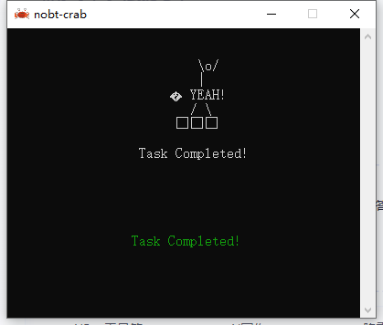

> **AI 给你的最大礼物，不是它能帮你做什么，而是它让你敢于尝试以前想都不敢想的事。**

---

## 🎯 事情的起点

作为一个 Java 后端开发者，Windows 客户端开发对我来说一直是"别人的领域"。

直到有一天，我盯着屏幕上那个自己做出来的 Windows 客户端窗口，问了自己一个问题：

**"这东西，真的是我做的吗？"**

在 AI Agent 时代之前，这个问题答案是肯定的："不是我做的，我不懂 Windows 开发。"

在 AI Agent 时代之后，答案变成了："是我做的，虽然我之前不懂，但现在我懂了。"

---

## 🤔 "不敢想"的三个原因

### 原因 1：技术栈完全陌生

**在此之前我的认知：**
```
Windows 客户端 = C# / .NET / WPF / WinForms
               = 完全陌生的生态
               = "这不是我的领域"
```

**传统解决思路：**
- 找个会 C# 的朋友帮忙
- 用 Java Swing/JavaFX 写一个（然后被 UI 丑哭）
- 找个外包
- 最诚实的回答："我不会"

**AI Agent 时代的思路：**
- 直接说需求
- 让 AI 推荐技术栈
- 边做边学
- "不会"变成"可以学"

---

### 原因 2：学习成本太高

**传统学习路径的时间账：**

| 阶段 | 预计时间 | 实际完成率 |
|------|----------|------------|
| 学基础语法 | 1-2 周 | 60% |
| 理解核心概念 | 2-3 周 | 30% |
| 能写简单程序 | 1-2 月 | 15% |
| 做出可用产品 | 3-6 月 | <5% |

**大部分人（包括我）在第一步就放弃了。**

**AI Agent 学习路径：**

| 阶段 | 实际时间 | 完成方式 |
|------|----------|----------|
| 环境搭建 | 30 分钟 | AI 自动配置 |
| Hello World | 10 分钟 | AI 生成代码 |
| 核心功能 | 2-3 天 | AI 边写边教 |
| 打包发布 | 1 天 | AI 处理配置 |

**总耗时：约 1 周 vs 传统 3-6 月**

但这不是重点，重点是**心理门槛**。

---

### 原因 3：未知的坑太多

Windows 客户端开发的坑，只有做过的人才知道：

- 打包后没有图标
- 没有版本信息
- 被 Windows Defender 报毒
- 依赖缺失
- 兼容性问题
- 权限问题

**传统方式：** 每个坑都要自己踩一遍，然后在 Stack Overflow 泡三天。

**AI 方式：** 提前预警 + 直接给解决方案。

---

## 🏗️ 实际开发过程

### 第一阶段：从"我不会"到"试试呗"

**传统心态：**
> "我不会 Windows 开发，这个需求做不了。"

**AI 时代心态：**
> "我没做过 Windows 开发，但可以让 Claude Code 带我学。"

**实际对话：**
```
我：我需要一个 Windows 客户端工具，选什么技术栈？

Claude Code: 给你几个选项：
  - C#/.NET: 生态成熟，但需要运行时
  - Java: 你熟悉，但启动慢、体积大
  - Rust: 单 exe、原生启动、CLI 友好
  - Electron: Web 技术栈，但体积大

  综合考虑，推荐 Rust。
```

**一个 Java 开发者，被推荐学 Rust。**

放在以前，我会觉得这人不正常。

放在现在，我觉得 AI 说得对。

---

### 第二阶段：从"试试呗"到"好像能做"

**项目启动后的对话流：**

```
我：创建 Rust 项目
→ cargo init nobt-client 完成

我：怎么读 YAML 配置？
→ serde + serde_yaml 示例代码生成

我：CLI 命令怎么处理？
→ clap 库推荐 + 完整示例

我：打包成 exe 没有图标怎么办？
→ winres 配置 + build.rs 脚本生成

我：这个编译错误什么意思？
→ 所有权/借用问题解释 + 修复方案
```

**学习曲线的变化：**

| 问题类型 | 传统方式耗时 | AI 方式耗时 |
|----------|--------------|-------------|
| 环境配置 | 2-3 小时 | 30 分钟 |
| 语法错误 | 30 分钟 -2 小时 | 30 秒 |
| 库选择 | 1 小时 Google | 直接推荐 |
| 概念理解 | 2 小时视频 | 5 分钟举例 |
| 调试 Bug | 半天打印日志 | AI 分析 + 修复 |

**效率提升不是 2 倍，是 10 倍以上。**

但更重要的是**正反馈循环**。

---

### 第三阶段：从"好像能做"到"真的做出来了"

**当第一个可运行的 exe 出现在面前时：**



**那种感觉：**
- 不是抄的，是一行一行写出来的
- 不是别人教的，是边做边学学会的
- 不是碰巧跑通的，是理解了原理的

**但如果没有 AI，我根本不会开始。**

---

## 🔍 核心洞察

### 洞察 1：AI 降低的不是成本，是门槛

**有一种误解：** "AI 让学习变得太容易，自己学不到东西。"

**我的体验：恰恰相反。**

| 场景 | 没有 AI | 有 AI |
|------|---------|-------|
| 遇到语法错误 | 查文档 30 分钟，可能还看不懂 | AI 解释 30 秒，还举一反三 |
| 不知道用哪个库 | Google 1 小时，看 Star 数 | AI 直接推荐最优解 |
| 理解反直觉概念 | 看视频教程 2 小时 | AI 用生活例子类比 |
| 调试莫名其妙的 Bug | 打印日志猜原因 | AI 分析根因 + 修复建议 |

**AI 省去的不是学习时间，是无效摸索时间。**

学到的东西一点没少，反而更多——因为能走得更远。

---

### 洞察 2："准备好再开始"的时代结束了

**传统学习观：**
```
1. 先学基础语法
2. 再看核心概念
3. 然后做练习项目
4. 最后才能做真需求
```

**这个路径的问题：** 90% 的人在第 2 步就放弃了。

**AI 时代的学习观：**
```
1. 有个想法/需求
2. 直接开始做
3. 遇到问题问 AI
4. 做完项目，技能也学会了
```

> **最好的学习，不是准备好了再开始，而是开始了自然就准备好了。**

---

### 洞察 3：勇气比能力更重要

**在 AI 时代之前：**
- 勇气 = "明知有坑也要踩"
- 能力 = "避开所有已知的坑"

**在 AI 时代之后：**
- 勇气 = "愿意尝试未知领域"
- 能力 = "会用 AI 填平未知的坑"

**这个变化的本质：** 从"个人能力竞争"转向"人机协作能力竞争"。

---

## 📊 实际效果对比

| 指标 | 传统方式 | AI Agent 方式 | 提升 |
|------|----------|---------------|------|
| **启动速度** | "我不懂，做不了" | "试试呗" | 从 0 到 1 |
| **环境搭建** | 2-3 小时 | 30 分钟 | 4-6x |
| **第一个功能** | 1-2 天 | 2 小时 | 8-12x |
| **配置系统** | 3-5 天 | 1 天 | 3-5x |
| **打包发布** | 1-2 周 | 3 天 | 3-4x |
| **总体时间** | 2-3 周 | 约 1 周 | 2-3x |

**但时间效率不是重点。**

**重点是：如果没有 AI，这个项目的启动概率是 0%。**

---

## 📝 给实践者的建议

### 如果你有"不敢想"的想法

**传统建议：**
- 先评估可行性
- 再评估风险
- 最后评估能力

**AI 时代的建议：**
1. **直接开始做**：AI 会告诉你第一步怎么走
2. **小步验证**：每个功能点快速试错
3. **遇到问题就问**：AI 是你的私人教练
4. **不要怕暴露无知**：AI 不会笑话你

---

### 如何克服"我不配"的心态

**"我不配"的来源：**
- 我没学过这个技术栈
- 我没有相关经验
- 我做不了这么复杂的东西

**AI 的解法：**

| "我不配" | AI 解法 |
|----------|---------|
| 没学过技术栈 | AI 边写代码边教学 |
| 没有经验 | AI 提前预警常见坑 |
| 做不了复杂东西 | AI 帮你拆解成小步骤 |

**最大的底气：** 你知道无论如何，都有个随叫随到的专家帮你。

---

### 选择技术栈的原则

**我的经验：**

| 原则 | 说明 | 示例 |
|------|------|------|
| **选 AI 支持好的** | 训练数据多，回答质量高 | Rust > Zig |
| **选生态成熟的** | 有现成库可用 | clap > 手写解析 |
| **选长期有价值的** | 不是昙花一现 | Rust 连续多年最受欢迎 |
| **选适合自己成长的** | 稍微跳一跳够得着 | Java 开发者学 Rust |

---

## 🌅 尾声

**AI Agent 时代，最大的风险不是"尝试了失败"，而是"因为害怕而不敢尝试"。**

> **纸上谈兵一万次，不如真正动手做一次。**

当我盯着那个自己做出来的 Windows 客户端窗口时，我意识到一件事：

**这不是什么技术奇迹，这是 AI 给普通人的勇气。**

在 AI 时代之前，这种"不敢想"的事情还有很多：
- 一个人做一个完整的产品
- 一周学会一门新语言
- 一天搞定从未接触过的领域
- 边做边学而不是先学再做

在 AI 时代之后，这些"不敢想"正在变成"试试看"。

**而你，有什么"不敢想"的事情？**

也许是一门新技术，也许是一个新项目，也许是一次职业转型。

**不管是什么，开始吧。**

因为最好的开始时间，永远是现在。

而且这一次，你不需要一个人。